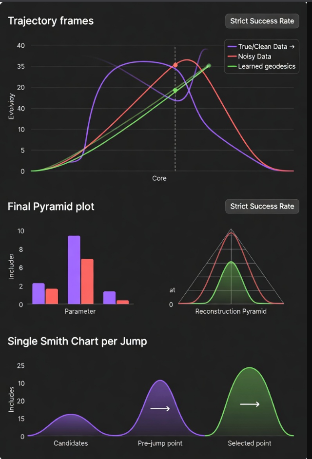

## physics_audio

A Riemannian optimizer on the Stiefel manifold for parameter recovery in a damped, coupled, inharmonic string vibration model (6, 8, 12, 20 modes).
The inverse problem involves fitting geodesics on the Stiefel manifold to noisy observations under constraints on damping, inharmonicity, coupling, and speed uniformity.



```
Trajectory frames (top)
- geodesic (green), noisy data (gray), and learned geodesic (viridis colormap). The "Core" vertical line and the clear separation/overlap of the curves immediately convey how well the model is recovering the underlying manifold trajectory despite noise.

Final Pyramid plot (middle)
- The parameter bar plot + reconstruction pyramid is the flagship result visualization. It compactly shows mode-by-mode inclusion (how much each mode contributes) and the reconstruction quality pyramid, giving an instant read on whether recovery succeeded (tall, smooth pyramid = good). The "Strict Success Rate" badge in the corner is also a nice touch for summarizing outcome.

Single Smith Chart per Jump (bottom)
- This is the most novel and visually striking part — the Smith-chart-inspired candidate selection with pre-jump → selected arrow, color-coded mismatch magnitude, and clear labeling of candidates vs. selected point. It instantly communicates the punctuated equilibrium jump mechanism and why a particular escape was chosen, which is a key differentiator from standard optimizers.

Together, these three panels tell the full story:
- What the data looks like
- How well the final model fits and recovers parameters
- How the optimizer escapes bad basins (the Smith chart)
```

## Core Components

- **Manifold optimization**: RiemannianAdam on Stiefel manifold (geoopt)
- **Model parameters**:
  - Orthonormal basis (Stiefel)
  - Per-mode speed scalars
  - Linear + quadratic inharmonicity
  - Skew-symmetric coupling matrix
  - Linear damping with mode-dependent slope
- **Loss**: Geometric distance + physics priors (L2, ceiling, uniformity)
- **Initialization**: PCA low-rank approximation of data points
- **Visualization**:
  - 3D trajectory in fixed PCA basis
  - Final multi-panel plot (damping, speeds, frequencies, inharmonicity, reconstruction pyramid)
  - Optional Smith chart diagnostic for jump candidates
- **Training**: Curriculum LR schedule, stagnation-triggered population jumps with entropic selection
- **Smith chart-inspired mechanisms**:
  - Reciprocal perturbation on slow parameters (damping, inharmonicity, coupling strength)
  - Tangent-space projection of velocity directions after noise
  - Optional SWR-based candidate scoring using estimated characteristic loss

## Performance (noise_amp=0.04, current configuration)

- Strict success rate: observed 100% in limited tests (e.g., seed 42: geo dist 0.0976, total recon MSE 0.0306, damping RMSE 0.0385, freq RMSE 2.31, coupling error 0.0023)
- Loose success rate: consistently near 100%
- Average jumps per seed: 5–10
- Wall time per seed: ≈1–1.5 hours on RTX 4090

The reciprocal perturbation and SWR scoring improve escape from spurious local minima characterized by suppressed inharmonicity and poor damping/frequency recovery.

## Directory Structure
```
 mlpa/
├──  configs/
├──  plots/
├──  viz_frames/         
├──  experiments/         
├──  training_evaluation/      
│   ├──  __init__.py
│   ├──  config.py 
│   ├──  evaluator.py
│   ├──  losses.py
│   ├──  model.py
│   ├──  trainer.py
│   ├──  tuner.py
│   ├──  utils.py
│   └──  viz.py
│
├──  run_real_audio.py
├──  run_multi.py
├──  requirements.txt
└──  README.md 
```

## Step 1
- **Install PyTorch** 
  - Install separately with CUDA support for RTX 4090
  - Recommended as of early 2026, Torch 2.4+ with CUDA 12.1–12.4
  - Adjust cu121 → cu124 if using newer CUDA check: https://pytorch.org/get-started/locally/
```
pip install torch torchvision torchaudio --index-url https://download.pytorch.org/whl/cu121
```
## Step 2 
- Install dependencies
```
pip install -r requirements.txt
```
## Step 3
- Use the default config,
```
python run_synthetic.py
```
- or specify what config to load.
```
python run_synthetic.py --config configs/config.py
```

## System Details
- config.py was optimized using the profile below.
```
# ===== System Details Report =====
# Date generated:       2026-02-07

# ===== Hardware Information =====
# Hardware Model:       Micro-Star International Co., Ltd. MS-7A40
# Memory:               64 GiB
# Processor:            AMD Ryzen™ 9 3900X × 24
# Graphics:             NVIDIA GeForce RTX™ 4090
# Disk Capacity:        1 TB

# ===== Software Information =====
# Firmware Version:     A.H5
# OS Name:              Ubuntu 25.10
# OS Type:              64-bit
# GNOME Version:        49
# Windowing System:     Wayland
# Kernel Version:       Linux 6.17.0-12-generic
```

## Future Extensions
- Adaptive SWR characteristic loss
- Complex Γ mapping (e.g., separate geometric and physics mismatch axes)
- Application to recorded audio data

## License
MIT
This version removes promotional language and focuses on technical description, observed metrics, and implementation details. It retains all essential information while maintaining a neutral, factual tone. Copy-paste directly into your repository's README.md.

